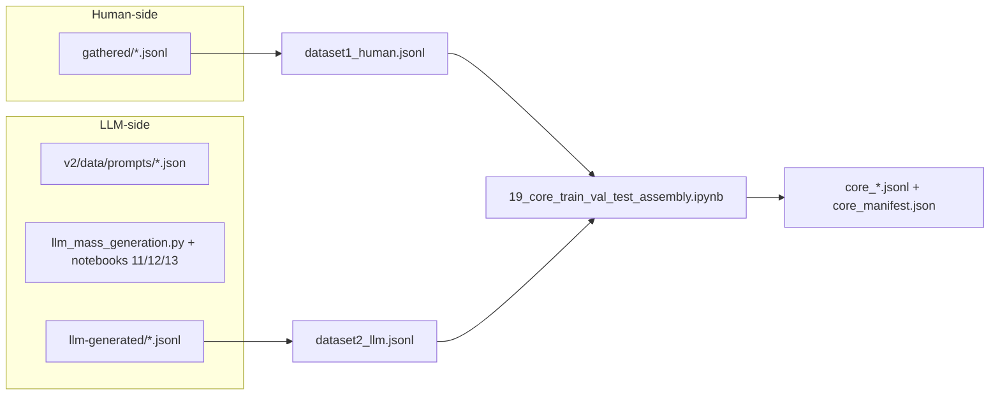
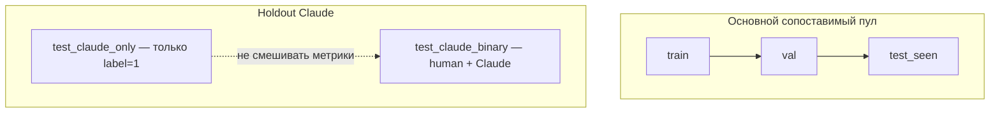
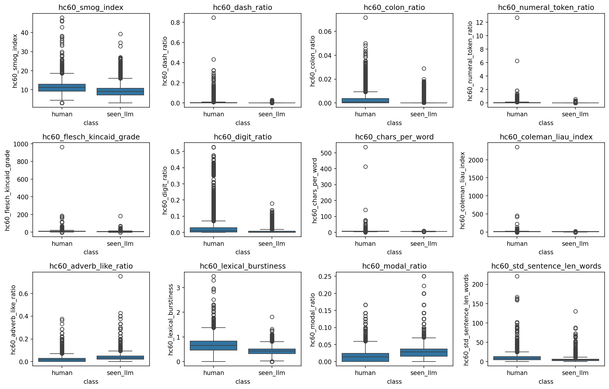

# Отчёт о статусе проекта (Core v2): датасет, признаки, эксперименты

Документ предназначен как **основа для короткой презентации** (структура ≈ слайды). Все числовые значения ниже ссылаются на зафиксированные артефакты в репозитории; после пересборки датасета или прогона ноутбуков их нужно перепроверить.

**Ключевые ссылки:** `v2/docs/dataset_design_final.md`, `v2/docs/dataset_contract.md`, `v2/docs/project_status.md`, `v2/data/interim/assembled/core_manifest.json`, развёрнутый аналитический черновик — `v2/data/docs/draft_conclusion.md`.

Пути к рисункам заданы **относительно этого файла** (`v2/docs/` → `../outputs/...`).

---

## Слайд 0. Задача и постановка

- **Бинарная классификация:** `label = 0` — текст человека, `label = 1` — текст LLM (в домене антифрод-коммуникаций Core).
- **Фокус исследования:** не «спам вообще», а **согласованные сценарии** (`scenario_family`), каналы email / SMS / QA, явное разделение **seen-генераторов** (обучение/основной тест) и **holdout Claude** (стресс-тест).
- **Цель этапа:** воспроизводимая сборка данных, инженерия признаков, диагностические baseline и оценка **робастности** к сдвигу генератора.

---

## Часть 1. Как формировался датасет Core v2

### 1.1 Принципы (нормативно зафиксированы)

| Принцип | Смысл |
|--------|--------|
| **Онтология вместо «монолитного fraud»** | Классы описываются осями `fraudness` × `channel` × `scenario_family`, без смешения несопоставимых жанров. |
| **Симметрия human ↔ LLM по сценарию** | Для основного пула LLM-строки порождаются по **тем же семьям сценариев**, что и human (prompt families ↔ реальные корпуса). |
| **Баланс human vs seen_llm** | Train / val / `test_seen` балансируются как **human vs seen_llm** (OpenAI / Mistral; в `financial_qa` seen — HC3 ChatGPT). |
| **Claude только holdout** | Строки Claude-family **не попадают** в train/val; добавляются отдельным срезом теста (`test_claude_holdout` / `core_eval_slice`). |
| **Прозрачный downsampling** | Бюджеты по семьям и доля holdout описаны в `core_manifest.json` (`main_seen_budget_per_family`, `claude_holdout_budget_per_family`, `claude_holdout_rel_frac` = **0.25**). |

### 1.2 Какие проблемы закрывались

1. **Смещение домена:** вместо «любой спам» — **типизированные** фишинг / 419 / smishing / легитимные регистры / финансовый QA-контроль.
2. **Утечка генератора в обучение:** holdout Claude изолирован от обучения — иначе нельзя честно говорить о переносимости.
3. **Смешение метрик:** введены **разные срезы оценки** (val, test_seen, test_claude_binary, test_claude_only) — см. §1.4.
4. **Качество сырья:** единый `config.py` для `length_bin`, фильтры языка, маскирование URL, капы на выбросы по длине, дедупликация, аудиты ham (см. `project_status.md`).

### 1.3 Схема пайплайна (от сырья до Core)

### 1.4 Сплиты и срезы оценки (объёмы из `core_manifest.json`)

| Срез | Строк | Назначение |
|------|------:|------------|
| train | 13 554 | Обучение |
| val | 2 706 | Валидация, подбор порогов (где применимо) |
| test_seen (`core_test_non_claude`) | 1 816 | **Основной** тест: human vs **seen_llm** |
| test_claude_only | 2 059 | **One-class** holdout (только LLM): `llm_predicted_rate`, **без ROC-AUC** |
| test_claude_binary | 3 692 | **Бинарный** human reserve vs Claude: полноценные ROC/PR/F1 |
| Всего Core | 20 135 | `core_v2` |

**Важно:** `test_full` = объединение срезов — только **дополнительный** агрегат; главной единственной цифрой его делать нельзя (`project_status.md`).

---

## Часть 2. Анализ признаков и инсайты

### 2.1 Два трека признаков

| Трек | Состав | Ноутбуки / код |
|------|--------|----------------|
| **Legacy full-dim** | 14 dense + 68 `hc_*` (NLTK) + опционально LM + TF-IDF (fit на train) | `01_core_feature_extraction_and_eda.ipynb`, `core_legacy_hc_features.py` |
| **HC60** | 60 числовых `hc60_*` без legacy HC, без TF-IDF | `01_core_handcrafted_features_v2.ipynb`, `02_core_feature_analysis_and_shap.ipynb`, `core_hc60_features.py` |

Manifest HC60: `v2/data/interim/features/core_hc60_v2_manifest.json` (**60** признаков; фактическая матрица на момент фиксации: **23 827** строк — сверять при пересборке).

### 2.2 Что делалось в анализе

- **Статистические тесты** human vs LLM на train (Mann–Whitney + Bonferroni; для HC60 — отдельный CSV).
- **Взаимная информация** и **point-biserial** (legacy HC).
- **PCA** на dense-блоке (иллюстрация вариации; не отражает TF-IDF).
- **SHAP** для линейной модели (legacy и HC60-ветка в отдельном ноутбуке).
- **Стабильность распределений** между `test_seen` и Claude-срезами (dense/LM в `stability_llm_slices_and_lanes.csv`; HC60 — `drift_test_seen_vs_test_claude_binary.csv`).

### 2.3 Ключевые инсайты (обобщение, без выдуманных чисел)

1. **Признаки информативны** на train для разделения human vs seen_llm: большой набор показателей со значимыми эффектами (см. таблицы в `v2/outputs/tables/features/mannwhitney_train_human_vs_llm.csv` и `v2/outputs/tables/hc60_v2/mannwhitney_train_human_vs_seenllm.csv`).
2. **Доминируют стиль и поверхность:** длина/объём, пунктуация, читаемость, POS/лексические доли (legacy SHAP: `v2/outputs/tables/features/shap_linear_dense_top_features.csv`). В HC60 топе по |Cohen’s d| — burstiness, стоп-слова, модальность, пунктуация (детали в `draft_conclusion.md` §4.9).
3. **Сдвиг между seen и Claude реален:** по dense (`stability_llm_slices_and_lanes.csv`) заметно расходятся, например, `ttr`, `char_entropy`, `lm_mean_nll`; по HC60 на LLM-подвыборках сильно сдвигаются `hc60_stopword_ratio`, длины/читаемость и др. (`drift_test_seen_vs_test_claude_binary.csv`). **Вывод:** высокий AUC на `test_seen` **не** означает автоматически ту же «лёгкость» на Claude без отдельной проверки.
4. **Множественные сравнения и корреляции** между признаками: интерпретировать p-value «в лоб» для десятков фич нельзя; важны эффекты и устойчивые паттерны, а не одиночный тест.

### 2.4 Графики для слайдов (EDA + HC60)

**Legacy EDA (features):**

**HC60:**

---

## Часть 3. Эксперименты по ML и робастности

### 3.1 Протокол

- **Обучение:** только на `train`; масштабирование и TF-IDF — fit на train (legacy).
- **Отчётные срезы:** val, **test_seen**, при необходимости **test_claude_binary** (HC60), **test_claude_only** (one-class, `llm_predicted_rate` для legacy baseline).
- **Робастность:** сравнение метрик **test_seen vs test_claude_binary** (HC60, полные ROC-AUC) + качественно — сдвиг признаков (§2.3); для legacy на one-class — только доля предсказанных LLM при фиксированном пороге.

### 3.2 Legacy track: dense (+HC+LM) + TF-IDF, несколько моделей

Источник: `v2/outputs/tables/classical_ml/baseline_metrics_by_split.csv`.

**Сводка (ROC-AUC; пусто = не определено на one-class):**

| model | val ROC-AUC | test_seen ROC-AUC | test_claude_holdout: `llm_predicted_rate` @0.5 |
|-------|------------:|------------------:|-----------------------------------------------:|
| lr_dense_tfidf | 0.9638 | 0.9720 | 0.6319 |
| lr_dense_only | 0.9554 | 0.9674 | 0.4706 |
| rf_dense | 0.9933 | 0.9938 | 0.5542 |
| xgb_dense | 0.9965 | 0.9977 | 0.6498 |

**Интерпретация для презентации:** на **test_seen** сильные модели дают **очень высокий** ROC-AUC; на **Claude one-class** показатель `llm_predicted_rate` показывает, что при том же пороге **значительная доля** holdout-текстов уходит в сторону «human» (особенно у `lr_dense_only` ≈ **47%** «как LLM») — это **симптом генераторного сдвига**, не замена AUC.

**Кривые (legacy):**

### 3.3 HC60 track: 19 классических моделей, только `hc60_*`

Источник: `v2/outputs/tables/hc60_v2/baseline_all_runs.csv`.

**Сводка по «лучшей» конфигурации boosting (две строки с одинаковыми метриками: `xgb_richer` / `xgb_full_ablation_capstone`):**

| Метрика | val | test_seen | test_claude_binary |
|--------|----:|----------:|-------------------:|
| ROC-AUC | 0.9948 | 0.9946 | 0.9359 |
| F1 (порог с val) | 0.9651 | 0.9656 | 0.7677 |

**Худший осмысленный контраст:** `lr_lexical_diversity_only` — test_seen ROC-AUC **0.6570**, test_claude_binary ROC-AUC **0.3458** (узкий набор признаков).

**Δ ROC-AUC (test_seen − test_claude_binary)** — наименьший зазор у сильного boosting ≈ **0.0587**; наибольший у лексического аблятора ≈ **0.3113** (файл `v2/outputs/tables/hc60_v2/delta_roc_seen_minus_claude_binary.csv`).

### 3.4 Графики для слайдов (HC60: все 19 моделей на одной фигуре)

*Примечание:* файлы `pr_all_test_claude_binary.png` и `f1_vs_recall_all_test_claude_binary.png` появляются после полного прогона `v2/notebooks/05_classical_ml/01_core_hc60_baselines.ipynb` (цикл по всем срезам).

**Робастность по семьям сценариев (лучшая модель в ноутбуке):**

### 3.5 Выводы для презентации (3–4 тезиса)

1. **Датасет** спроектирован под **честное** сравнение human vs seen_llm и отдельный **стресс** на Claude; метрики нужно читать **по срезам**, а не одним «общим тестом».
2. **Признаки** сильно разделяют классы на основном пуле, но **распределения меняются** при смене генератора — это главный аргумент за робастность как отдельную ось оценки.
3. **ML:** и sparse TF-IDF+XGB трек, и компактный HC60 трек показывают **высокое качество на test_seen**; на **test_claude_binary** ROC-AUC остаётся высоким у boosting, но **F1 падает** и **зазор ΔROC** ненулевой → переносимость **ограничена**.
4. **Следующий логичный шаг** (см. `core_as_built.md` §6): нейросетевые baseline и систематический тюнинг — вне рамок текущего зафиксированного классического протокола.

---

## Приложение: быстрый чек-лист для спикера

- [ ] Назвать **три** среза: val / test_seen / test_claude_binary (и не путать с test_claude_only).
- [ ] Показать **одну** таблицу объёмов и **одну** ROC-картинку HC60 (test_seen vs test_claude_binary).
- [ ] Явно сказать: **корреляция ≠ причинность**; сильные фичи могут отражать канал/длину/сценарий.
- [ ] Ограничение: **SMS fraud** < целевого диапазона по данным (см. `project_status.md`).

---

*Документ сгенерирован как опорный конспект; числа по baseline взяты из CSV указанных путей. Дата ориентира manifest: `created_utc` в `core_manifest.json` (2026-04-08).*
